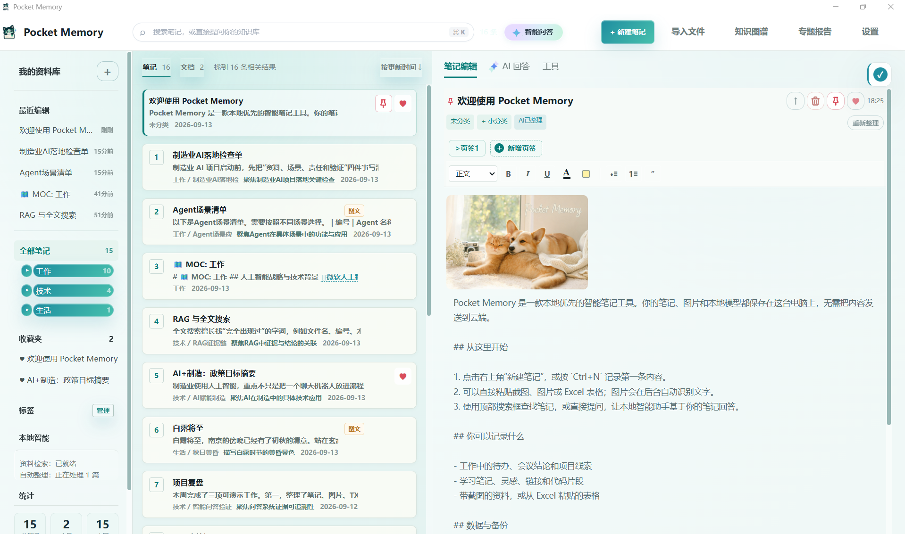
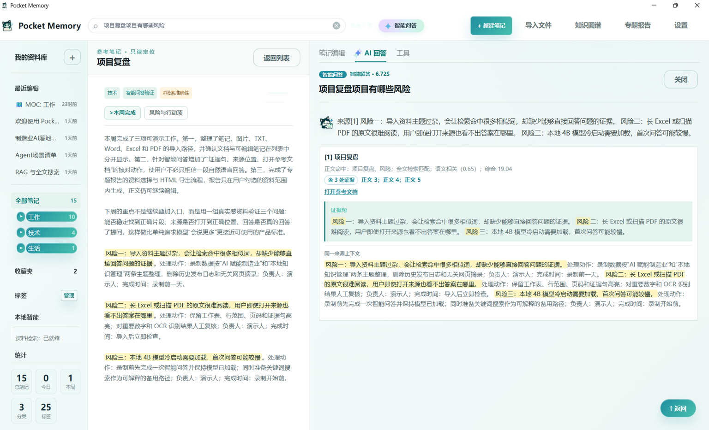

# Pocket Memory

Pocket Memory is a Windows-first, local knowledge workspace for notes and files. It helps you record material, import documents, retrieve evidence, ask questions against local sources, and return to the original location for review.

## Product tour

### [Open the live product tour ->](https://ashleysama.github.io/pocket-memory-agent/)

<p align="center">
  
</p>

<p align="center"><i>One workspace for notes, files, editing, and source-grounded answers.</i></p>

<p align="center">
  
</p>

<p align="center"><i>Answers are paired with evidence, source information, and a path back to the original material.</i></p>

> **Beta software.** This repository is for evaluation and community collaboration. It is not a guarantee of factual correctness, a substitute for source review, or a security-certified enterprise product.

## What it does

- Multi-tab rich-text notes with tables, images, history, pinning, favorites, folders, tags, backlinks, and a local relation graph.
- Import TXT, DOCX, XLSX, PDF, and images. Content is parsed into locatable chunks such as paragraphs, pages, worksheets, and row ranges.
- Hybrid retrieval combining full-text, keyword, and local semantic search, followed by lightweight reranking.
- Local evidence-grounded Q&A that shows a concise answer, source, evidence sentence, and an entry point back to the original note or document.
- OCR for local images, original-file replacement and re-indexing, full backup, data-directory switching, and editable HTML topic-report drafts.

## Local-first design

- Notes, attachments, SQLite metadata, indexes, and configured models are stored in local directories.
- The application binds its unauthenticated HTTP service to loopback addresses only.
- The default Q&A path uses a local GGUF model. No cloud LLM API key is required.

This is not an absolute security guarantee. Do not use an unreviewed Beta build as the sole control for sensitive, regulated, or high-risk decisions. Always verify important numbers, dates, authorization rules, quality, and safety information in the original source.

## Quick start: source checkout

### Prerequisites

- Windows 10/11
- Python 3.11 or later
- Microsoft Edge WebView2 Runtime recommended for the desktop window
- Optional local model files for semantic search, OCR, automatic organization, and Q&A

```powershell
git clone https://github.com/<your-account>/PocketMemory.git
cd PocketMemory
.\setup_venv.bat
.\run_dev.bat
```

For an isolated local data directory during development:

```powershell
.\.venv\Scripts\python.exe app.py --data-dir .\dev-data --no-browser
```

The repository deliberately does **not** contain model weights, user notes, databases, release archives, or test outputs. See [Model setup and licenses](docs/MODELS.md) before adding models.

## Typical workflow

1. Create a note or import files.
2. Review the extracted document chunks when the material is complex.
3. Search by title, keyword, or a natural-language question.
4. For important answers, open the cited source and verify the highlighted evidence in context.
5. Select relevant materials to generate an editable HTML topic report when you need a structured output.

## Quality and limitations

Pocket Memory uses retrieval-augmented generation (RAG), not a guaranteed fact database. Retrieval can miss relevant material or select a superficially similar passage. OCR and complex spreadsheet/PDF parsing can also be imperfect. The public fixtures are synthetic regression materials; they are **not** evidence that the product has passed a real-user acceptance benchmark.

Read [RAG limitations and evaluation](docs/RAG_LIMITATIONS_AND_EVALUATION.md) before relying on Q&A results.

## Development

Run the unit and integration suite:

```powershell
$env:PYTHONDONTWRITEBYTECODE='1'
python -m unittest discover -s tests -q
```

The public preparation baseline passes 187 automated tests locally. Model-backed smoke tests and final packaged-EXE checks remain separate release gates.

## Documentation

- [Windows installation and local operation](docs/INSTALL_WINDOWS.md)
- [Architecture](docs/ARCHITECTURE.md)
- [Model setup and third-party model boundaries](docs/MODELS.md)
- [Privacy and data boundaries](docs/PRIVACY.md)
- [RAG limitations and evaluation](docs/RAG_LIMITATIONS_AND_EVALUATION.md)
- [Third-party notices](THIRD_PARTY_NOTICES.md)
- [Contributing](CONTRIBUTING.md)
- [Security reporting](SECURITY.md)

## License

The Pocket Memory source code is licensed under [Apache-2.0](LICENSE). Model weights, OCR assets, example data, fonts, and third-party packages are governed by their own licenses. See [THIRD_PARTY_NOTICES.md](THIRD_PARTY_NOTICES.md).

## Community feedback

Please use GitHub Issues for reproducible defects and feature proposals. Do not attach private notes, credentials, customer data, screenshots containing sensitive information, or model files to public issues.
